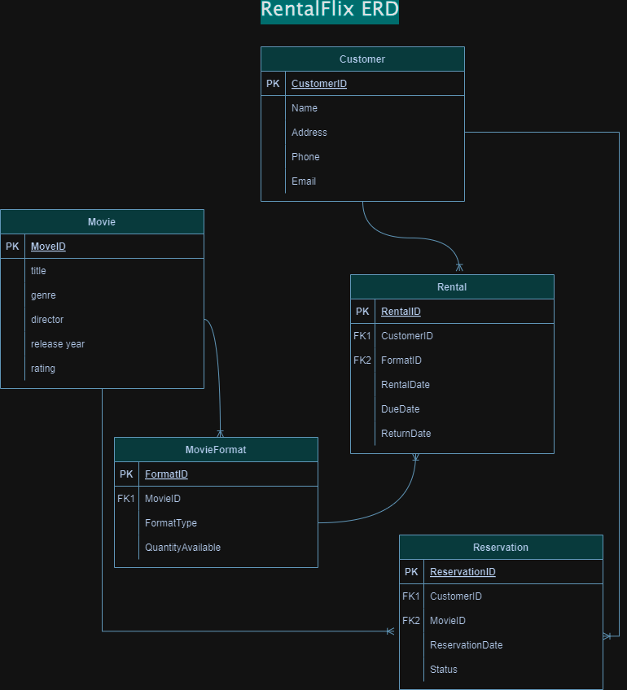

# RentalFlix Database Design

## Entity-Relationship Diagram (ERD)

This diagram showing the main components of the RentalFlix system:

## Entities

### Customer
- **CustomerID**: Unique customer ID.
- **Details**: Name, Address, Phone, Email.

### Movie
- **MovieID**: Unique movie ID.
- **Details**: Title, Genre, Director, Release Year, Rating.

### MovieFormat
- **FormatID**: Unique format ID.
- **Details**: MovieID, FormatType (DVD, Blu-ray, Digital), QuantityAvailable.

### Rental
- **RentalID**: Unique rental ID.
- **Details**: CustomerID, FormatID, RentalDate, DueDate, ReturnDate.

### Reservation
- **ReservationID**: Unique reservation ID.
- **Details**: CustomerID, MovieID, ReservationDate, Status.
